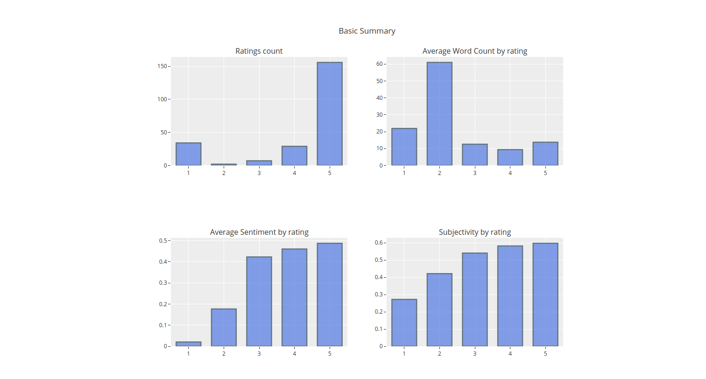

# Amazon Product Review Analysis
> A streamlit web app to perform sentiment analysis on Amazon reviews.

<!-- [![NPM Version][npm-image]][npm-url]
[![Build Status][travis-image]][travis-url]
[![Downloads Stats][npm-downloads]][npm-url] -->

The application scrapes user provided amazon product url to fetch the reviews. Then using NLTK and Textblob, preprocessing and sentiment analysis of the reviews are done. Plotly and Wordcloud are used for visualization.


## Installation

Linux:

```sh
git clone https://github.com/nikhil-varghese/sentiment-analysis-on-amazon-product-reviews.git
cd sentiment-analysis-on-amazon-product-reviews

pip install requirements.txt
streamlit run app.py
```

## Usage example

Enter any amazon product url to perform sentiment analysis.





## Release History


* 0.2.0
    * CHANGE: Remove `fasttext`
    * CHANGE: Switched to plotly for visualization
    * ADD: Added subjectivity analysis

* 0.1.0
    * The first proper release
    * CHANGE: Perform sentiment analysis on amazon reviews.
* 0.0.1
    * Work in progress


<!-- Markdown link & img dfn's -->
[npm-image]: https://img.shields.io/npm/v/datadog-metrics.svg?style=flat-square
[npm-url]: https://npmjs.org/package/datadog-metrics
[npm-downloads]: https://img.shields.io/npm/dm/datadog-metrics.svg?style=flat-square
[travis-image]: https://img.shields.io/travis/dbader/node-datadog-metrics/master.svg?style=flat-square
[travis-url]: https://travis-ci.org/dbader/node-datadog-metrics
[wiki]: https://github.com/yourname/yourproject/wiki